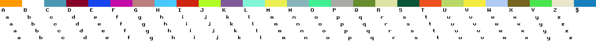
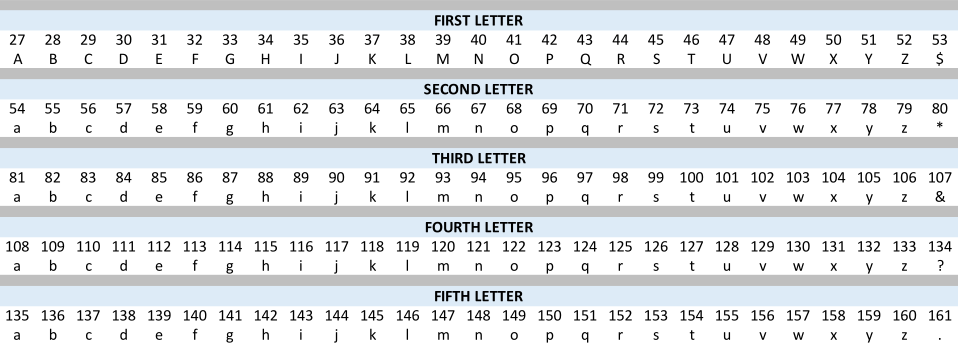

# Words on Bitcoin
A collector created ORC-721 project

## Introduction
Words on Bitcoin seeks to highlight the interactivity and composability possible with the [Generative ORC-721 Protocol](https://github.com/ordbase/generative-orc-721) developed by 
@geraldb. Creators can compose any word/character combination, 5 characters or less, and select a background color (if desired) from the [btc_words_spritesheet.png](./btc_words_spritesheet.png). Inscriptions are made using the standard ORC-721 JSON format.


## What's New?
The Generative ORC-721 Protocol lends itself by default to generating a composite of layers stacked into a unified image, such as a pfp. Words on Bitcoin explores the idea of dispersing the images to allow more complex composites - such as words. This is an attempt at maximum customization while working within the stremalined ORC-721 protocol.


**Examples (102px x 32px)**


## How it Works
Unlike a typical grid shaped spritesheet (10 x 10 ex), the [btc_words_spritesheet.png](./btc_words_spritesheet.png) contains 27 columns and 6 rows:


(white background imposed for visibility)


While this sounds intimidating at first, the logic is as follows:

**Row 1:**       27 background colors

**Row 2:**       All 26 capitalized letters of the English alphabet plus the '$' symbol / 1st letter position

**Rows 3 - 6:**  All 26 lower case letters of the English alphabet plus a special character / 2nd - 5th letter positions


**Example individual letter tiles in 8x**

 - Letter tile from Row 2

 - Letter tile from Row 3

 - Letter tile from Row 4

 - Letter tile from Row 5

 - Letter tile from Row 6

- By selecting a letter from each row on the spritesheet creators can compose any combination of 5 characters. Note that there is a special character available in each position. 

- If no background is selected, the resulting image will be transparent. 

- To leave a space, do not select a character for that position. For example, an inscription with the only spec as [0] would simply be a rectangle with the bitcoin orange background.


Here is a breakdown of one of the example images above (white backgrouond imposed for visibility):


 uses:


 - Bitcoin orange background

 - '$' in fisrt position

 - 'b' in second position

 - 't' in third position

 - 'c' in fourth position

No character in fifth position

## How to Inscribe
Words on Bitcoin are inscribed using the standard Generative ORC-721 JSON format. The inscribe file for the example above would be: 
```json
{
   "p":"orc-721",
   "op":"mint",
   "s":"btcwords",
   "g":[0, 53, 55, 100, 110]
}
```
**Notes**
- Before inscribing, BE SURE to check the validity of your JSON using a [JSON validator](https://jsonlint.com/)

- To help identify the correct sprites, use this character spec cheat sheet:



- Alternatively, use the [public image previewer](https://ordbase.github.io/generative-orc-721/btcwords/)

# Additional Notes

> The Generative ORC-721 Protocol and all projects built with it are experimental. Currently, there is no way to index the blockchain to scan for all valid inscriptions from any collection, although there are beta validators available for individual collections. For more information or to contribute to the development of the ORC-721 ecosystem, read the full Generative Art ORC-721 Github linked above, or join the conversation in the [Ordinal Punks discord](https://discord.gg/FTW9UDqv) in the Generative-orc-721 channel.

> Do NOT inscribe these if you are seeking financial gain

> DO inscribe these if you want to experiment with data sources stored on the bitcoin blockchain

