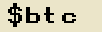

# Words on Bitcoin
A collector created ORC-721 project

## Introduction
Words on Bitcoin is a project designed to highlight the interactivity and composability possible with the [Generative ORC-721 protocol](https://github.com/ordbase/generative-orc-721) developed by 
@geraldb. Creators are able to compose any 5 character word, with spaces, and select a background color using the [btc_words_spritesheet.png](./btc_words_spritesheet). The file can then be inscribed using the standard ORC-721 JSON format.

## What's New?
The Generative ORC-721 Protocol lends itself by default to generating a composite image made of stacked layers creating a unified image, such as a pfp. Words on Bitcoin explores the idea of dispersing the position of the images to create more complex composites - such as words - in an attempt at maximum customization using the same stremalined ORC-721 format.  

**Examples (102px x 32px)**

# How it Works
Unlike a typical grid shaped spritesheet (10 x 10 ex.), The [btc_words_spritesheet.png](./btc_words_spritesheet) contains 27 columns and 6 rows:

While this sounds intimidating at first the logic is as follows:

Row 1:      27 background colors
Row 2:      All 26 capitalized letters of the English alphabet plus the '$' symbol / 1st letter position
Rows 3 - 6: All 26 lower case letters of the English alphabet plus a ' ' blank / 2nd - 5th letter positions

**Example individual letter tiles in 8x**

 - Letter tile from Row 2
 - Letter tile from Row 3
 - Letter tile from Row 4
